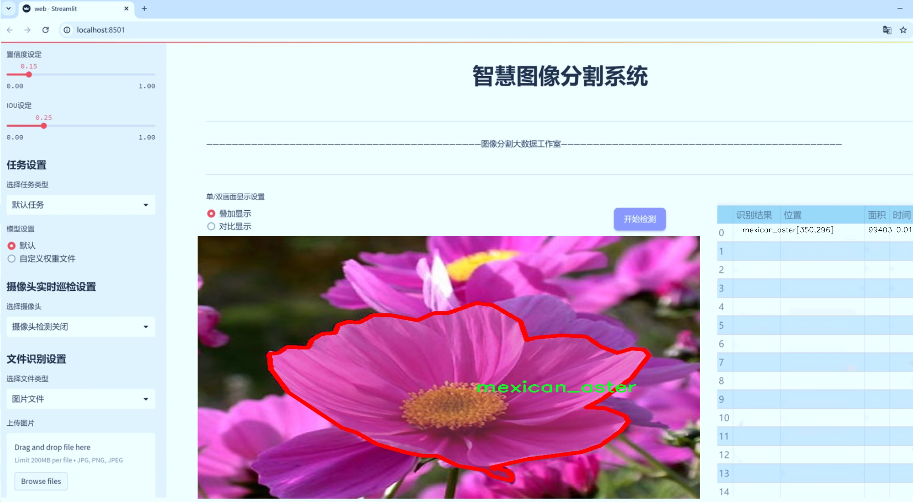

# 花卉图像分割系统源码＆数据集分享
 [yolov8-seg-C2f-FocusedLinearAttention＆yolov8-seg-C2f-EMBC等50+全套改进创新点发刊_一键训练教程_Web前端展示]

### 1.研究背景与意义

项目参考[ILSVRC ImageNet Large Scale Visual Recognition Challenge](https://gitee.com/YOLOv8_YOLOv11_Segmentation_Studio/projects)

项目来源[AAAI Global Al lnnovation Contest](https://kdocs.cn/l/cszuIiCKVNis)

研究背景与意义

随着计算机视觉技术的迅速发展，图像分割在多个领域中展现出了巨大的应用潜力，尤其是在自然图像处理和生物多样性研究中。花卉作为自然界中美丽而多样的生物，其图像分割的研究不仅能够帮助我们更好地理解植物的特征和分类，还能为生态保护、园艺设计和农业生产提供重要的数据支持。近年来，深度学习技术的兴起，尤其是目标检测与分割领域的进步，使得基于卷积神经网络（CNN）的模型在图像分割任务中取得了显著的成果。YOLO（You Only Look Once）系列模型因其高效的实时检测能力而备受关注，尤其是最新的YOLOv8版本，凭借其更优的性能和灵活性，为花卉图像分割提供了新的可能性。

本研究旨在基于改进的YOLOv8模型，构建一个高效的花卉图像分割系统。我们使用的花卉数据集包含7100张图像，涵盖126个不同的花卉类别，包括常见的玫瑰、向日葵、康乃馨等。这一丰富的类别和数量不仅为模型的训练提供了充分的数据基础，也为后续的花卉识别和分类研究奠定了坚实的基础。通过对这些花卉图像的精确分割，我们能够提取出每种花卉的特征信息，从而为植物分类、生态监测和环境保护提供数据支持。

在生态学和生物多样性研究中，花卉的分布和种类多样性是重要的研究内容。通过对花卉图像的分割和分析，研究人员可以更好地了解不同花卉在生态系统中的作用，以及它们与环境因素之间的关系。此外，花卉的分割技术还可以应用于农业领域，帮助农民监测作物生长情况、病虫害发生以及土壤质量等，从而提高农业生产效率和可持续性。

然而，现有的花卉图像分割技术仍面临许多挑战，例如不同光照条件、背景复杂性以及花卉姿态的多样性等问题。因此，改进YOLOv8模型以提高其在花卉图像分割任务中的准确性和鲁棒性，具有重要的理论意义和实际应用价值。通过引入先进的深度学习技术和图像处理算法，我们期望能够在花卉图像分割的精度和效率上取得突破，从而推动相关领域的研究进展。

综上所述，本研究不仅为花卉图像分割提供了一种新的解决方案，也为生态保护、农业生产和生物多样性研究提供了重要的技术支持。通过构建基于改进YOLOv8的花卉图像分割系统，我们希望能够为相关领域的研究者和从业者提供更为精准和高效的工具，促进科学研究与实际应用的深度融合。

### 2.图片演示




##### 注意：由于此博客编辑较早，上面“2.图片演示”和“3.视频演示”展示的系统图片或者视频可能为老版本，新版本在老版本的基础上升级如下：（实际效果以升级的新版本为准）

  （1）适配了YOLOV8的“目标检测”模型和“实例分割”模型，通过加载相应的权重（.pt）文件即可自适应加载模型。

  （2）支持“图片识别”、“视频识别”、“摄像头实时识别”三种识别模式。

  （3）支持“图片识别”、“视频识别”、“摄像头实时识别”三种识别结果保存导出，解决手动导出（容易卡顿出现爆内存）存在的问题，识别完自动保存结果并导出到tempDir中。

  （4）支持Web前端系统中的标题、背景图等自定义修改，后面提供修改教程。

  另外本项目提供训练的数据集和训练教程,暂不提供权重文件（best.pt）,需要您按照教程进行训练后实现图片演示和Web前端界面演示的效果。

### 3.视频演示

[3.1 视频演示](https://www.bilibili.com/video/BV1is2CYBEwo/)

### 4.数据集信息展示

##### 4.1 本项目数据集详细数据（类别数＆类别名）

nc: 102
names: ['alpine_sea_holly', 'anthurium', 'artichoke', 'azalea', 'ball_moss', 'balloon_flower', 'barbeton_daisy', 'bearded_iris', 'bee_balm', 'bird_of_paradise', 'bishop_of_llandaff', 'black_eyed_susan', 'blackberry_lily', 'blanket_flower', 'bolero_deep_blue', 'bougainvillea', 'bromelia', 'buttercup', 'californian_poppy', 'camellia', 'canna_lily', 'canterbury_bells', 'cape_flower', 'carnation', 'cautleya_spicata', 'clematis', 'colts_foot', 'columbine', 'common_dandelion', 'corn_poppy', 'cyclamen', 'daffodil', 'desert-rose', 'english_marigold', 'fire_lily', 'foxglove', 'frangipani', 'fritillary', 'garden_phlox', 'gaura', 'gazania', 'geranium', 'giant_white_arum_lily', 'globe_flower', 'globe_thistle', 'grape_hyacinth', 'great_masterwort', 'hard-leaved_pocket_orchid', 'hibiscus', 'hippeastrum', 'japanese_anemone', 'king_protea', 'lenten_rose', 'lotus', 'love_in_the_mist', 'magnolia', 'mallow', 'marigold', 'mexican_aster', 'mexican_petunia', 'monkshood', 'moon_orchid', 'morning_glory', 'orange_dahlia', 'osteospermum', 'oxeye_daisy', 'passion_flower', 'pelargonium', 'peruvian_lily', 'petunia', 'pincushion_flower', 'pink-yellow_dahlia', 'pink_primrose', 'poinsettia', 'primula', 'prince_of_wales_feathers', 'purple_coneflower', 'red_ginger', 'rose', 'ruby-lipped_cattleya', 'siam_tulip', 'silverbush', 'snapdragon', 'spear_thistle', 'spring_crocus', 'stemless_gentian', 'sunflower', 'sweet_pea', 'sweet_william', 'sword_lily', 'thorn_apple', 'tiger_lily', 'toad_lily', 'tree_mallow', 'tree_poppy', 'trumpet_creeper', 'wallflower', 'water_lily', 'watercress', 'wild_pansy', 'windflower', 'yellow_iris']


##### 4.2 本项目数据集信息介绍

数据集信息展示

在当今的计算机视觉领域，图像分割技术正逐渐成为研究的热点，尤其是在植物识别和分类方面。为此，我们构建了一个名为“flowers_segmentation”的数据集，旨在为改进YOLOv8-seg模型提供高质量的训练数据。该数据集专注于花卉图像的分割，涵盖了102个不同的花卉类别，展现了丰富的植物多样性和色彩变化，适合用于训练和评估深度学习模型在图像分割任务中的表现。

“flowers_segmentation”数据集中的类别包括了从常见的园艺植物到较为罕见的野生花卉，具体类别名称涵盖了“alpine_sea_holly”、“anthurium”、“artichoke”、“azalea”等等，直至“yellow_iris”。这些类别不仅反映了植物的多样性，也为模型的泛化能力提供了挑战。每个类别的图像都经过精心挑选和标注，确保数据的准确性和代表性。数据集中包含的图像在拍摄时考虑了不同的光照条件、背景和角度，以增强模型在实际应用中的鲁棒性。

数据集的构建过程中，我们特别关注了图像的质量和标注的精确性。每一张图像都经过严格的审核，以确保其清晰度和可用性。此外，标注工作由专业的植物学家和图像处理专家共同完成，确保每个花卉的轮廓和特征都被准确标识。这种高质量的标注为YOLOv8-seg模型的训练提供了坚实的基础，使其能够在复杂的环境中有效地识别和分割不同种类的花卉。

在训练过程中，模型将利用这些丰富的花卉图像数据，学习如何识别和分割不同的花卉特征。通过对比不同类别的花卉，模型能够捕捉到细微的差异，从而提高其分类和分割的准确性。随着训练的深入，模型不仅能够识别单一花卉，还能在复杂场景中同时处理多种花卉的分割任务，这对于园艺、生态监测和生物多样性研究等领域具有重要的应用价值。

此外，数据集的多样性也为未来的研究提供了广阔的空间。研究人员可以在此基础上进行迁移学习、模型优化以及新算法的开发，以进一步提升图像分割的精度和效率。无论是在学术研究还是工业应用中，“flowers_segmentation”数据集都将成为推动花卉图像分割技术进步的重要资源。

总之，“flowers_segmentation”数据集不仅是一个简单的图像集合，更是一个富有挑战性和研究价值的资源。它为改进YOLOv8-seg模型提供了必要的数据支持，使得研究人员能够在花卉图像分割领域取得更大的突破。随着对该数据集的深入研究，我们期待能够推动植物识别技术的发展，为生态保护和植物研究贡献更多的力量。


### 5.全套项目环境部署视频教程（零基础手把手教学）

[5.1 环境部署教程链接（零基础手把手教学）](https://www.bilibili.com/video/BV1jG4Ve4E9t/?vd_source=bc9aec86d164b67a7004b996143742dc)


[5.2 安装Python虚拟环境创建和依赖库安装视频教程链接（零基础手把手教学）](https://www.bilibili.com/video/BV1nA4VeYEze/?vd_source=bc9aec86d164b67a7004b996143742dc)

### 6.手把手YOLOV8-seg训练视频教程（零基础小白有手就能学会）

[6.1 手把手YOLOV8-seg训练视频教程（零基础小白有手就能学会）](https://www.bilibili.com/video/BV1cA4VeYETe/?vd_source=bc9aec86d164b67a7004b996143742dc)


按照上面的训练视频教程链接加载项目提供的数据集，运行train.py即可开始训练



     Epoch   gpu_mem       box       obj       cls    labels  img_size
     1/200     0G   0.01576   0.01955  0.007536        22      1280: 100%|██████████| 849/849 [14:42<00:00,  1.04s/it]
               Class     Images     Labels          P          R     mAP@.5 mAP@.5:.95: 100%|██████████| 213/213 [01:14<00:00,  2.87it/s]
                 all       3395      17314      0.994      0.957      0.0957      0.0843

     Epoch   gpu_mem       box       obj       cls    labels  img_size
     2/200     0G   0.01578   0.01923  0.007006        22      1280: 100%|██████████| 849/849 [14:44<00:00,  1.04s/it]
               Class     Images     Labels          P          R     mAP@.5 mAP@.5:.95: 100%|██████████| 213/213 [01:12<00:00,  2.95it/s]
                 all       3395      17314      0.996      0.956      0.0957      0.0845

     Epoch   gpu_mem       box       obj       cls    labels  img_size
     3/200     0G   0.01561    0.0191  0.006895        27      1280: 100%|██████████| 849/849 [10:56<00:00,  1.29it/s]
               Class     Images     Labels          P          R     mAP@.5 mAP@.5:.95: 100%|███████   | 187/213 [00:52<00:00,  4.04it/s]
                 all       3395      17314      0.996      0.957      0.0957      0.0845


### 7.50+种全套YOLOV8-seg创新点代码加载调参视频教程（一键加载写好的改进模型的配置文件）

[7.1 50+种全套YOLOV8-seg创新点代码加载调参视频教程（一键加载写好的改进模型的配置文件）](https://www.bilibili.com/video/BV1Hw4VePEXv/?vd_source=bc9aec86d164b67a7004b996143742dc)

### 8.YOLOV8-seg图像分割算法原理

原始YOLOV8-seg算法原理

YOLOv8-seg是Ultralytics在2023年推出的目标检测与分割的最新算法，代表了YOLO系列的又一次重大进步。作为YOLOv5的继承者，YOLOv8-seg在设计上结合了YOLO系列的多项创新，尤其是YOLOX、YOLOv6、YOLOv7和PPYOLOE等算法的优点，旨在提供更高的检测精度和更快的处理速度。其核心理念是通过高效的网络结构和优化的损失函数来实现实时目标检测和分割。

YOLOv8-seg的网络结构主要由输入层、主干网络、特征融合层和解耦头组成。其主干网络采用了CSP结构，利用C2f模块替代了YOLOv5中的C3模块，显著提升了模型的轻量化特性，同时保持了高精度的检测能力。C2f模块通过引入ELAN思想，增强了特征的重用性和梯度流动，确保在深层网络中不会出现梯度消失的问题。C2f模块的设计使得特征图在经过卷积后分为两个分支，其中一个分支直接连接到输出，而另一个分支则通过多个Bottleneck网络进行处理，最终将两个分支的特征进行融合。这种设计使得YOLOv8-seg能够更有效地提取目标的局部特征和全局特征。

在特征融合方面，YOLOv8-seg采用了PAN-FPN结构，以实现多尺度特征的有效融合。该结构通过自下而上的特征融合和自上而下的特征传递，确保了不同层次特征的充分利用。特征融合层的设计允许网络在不同的分辨率下对目标进行检测，保证了模型在处理不同尺寸目标时的鲁棒性和准确性。

YOLOv8-seg的检测网络采用了Anchor-Free的检测方式，摒弃了传统的Anchor-Base方法。这样的设计使得模型在目标检测时更加灵活，能够更好地适应各种形状和尺寸的目标。解耦头结构的引入使得分类和回归任务能够独立进行，从而提高了检测的精度和效率。具体而言，YOLOv8-seg的解耦头将分类和回归分支分开处理，利用Distribution Focal Loss作为回归损失函数，结合CIoU Loss进行边框回归。这种方法有效地解决了样本不平衡的问题，尤其是在处理小目标时，能够显著提高模型的学习能力。

在数据预处理方面，YOLOv8-seg采用了YOLOv5的增强策略，包括马赛克增强、混合增强、空间扰动和颜色扰动等。这些增强手段在训练过程中提高了模型的泛化能力，使得YOLOv8-seg能够在多种复杂环境下保持高效的检测性能。

此外，YOLOv8-seg的损失函数设计也值得关注。其使用的VFLLoss和DFLLoss结合了多种损失计算方式，旨在提高分类和回归的精度。通过优化损失函数，YOLOv8-seg能够更好地处理正负样本不平衡的问题，确保在训练过程中对困难样本的关注度，从而提升整体检测效果。

在实际应用中，YOLOv8-seg被广泛应用于各类目标检测任务，包括自动驾驶、智能监控、工业检测等领域。以苹果采摘为例，YOLOv8-seg能够通过其强大的视觉识别能力，自动检测和定位苹果，为自动采摘机器人提供实时的决策支持。同时，结合蚁群算法进行路径规划，进一步提升了自动采摘的效率和准确性。

总的来说，YOLOv8-seg算法通过其创新的网络结构、优化的损失函数和高效的数据处理策略，达到了实时检测领域的新高度。其在目标检测和分割任务中的优越表现，不仅推动了YOLO系列的发展，也为计算机视觉领域带来了新的机遇和挑战。随着YOLOv8-seg的不断完善和应用，未来在智能视觉系统中的潜力将更加广阔。


### 9.系统功能展示（检测对象为举例，实际内容以本项目数据集为准）

图9.1.系统支持检测结果表格显示

  图9.2.系统支持置信度和IOU阈值手动调节

  图9.3.系统支持自定义加载权重文件best.pt(需要你通过步骤5中训练获得)

  图9.4.系统支持摄像头实时识别

  图9.5.系统支持图片识别

  图9.6.系统支持视频识别

  图9.7.系统支持识别结果文件自动保存

  图9.8.系统支持Excel导出检测结果数据


### 10.50+种全套YOLOV8-seg创新点原理讲解（非科班也可以轻松写刊发刊，V11版本正在科研待更新）

#### 10.1 由于篇幅限制，每个创新点的具体原理讲解就不一一展开，具体见下列网址中的创新点对应子项目的技术原理博客网址【Blog】：


[10.1 50+种全套YOLOV8-seg创新点原理讲解链接](https://gitee.com/qunmasj/good)

#### 10.2 部分改进模块原理讲解(完整的改进原理见上图和技术博客链接)【如果此小节的图加载失败可以通过CSDN或者Github搜索该博客的标题访问原始博客，原始博客图片显示正常】

### YOLOv8简介
#### Backbone
Darknet-53
53指的是“52层卷积”+output layer。

借鉴了其他算法的这些设计思想

借鉴了VGG的思想，使用了较多的3×3卷积，在每一次池化操作后，将通道数翻倍；

借鉴了network in network的思想，使用全局平均池化（global average pooling）做预测，并把1×1的卷积核置于3×3的卷积核之间，用来压缩特征；（我没找到这一步体现在哪里）


使用了批归一化层稳定模型训练，加速收敛，并且起到正则化作用。

    以上三点为Darknet19借鉴其他模型的点。Darknet53当然是在继承了Darknet19的这些优点的基础上再新增了下面这些优点的。因此列在了这里

借鉴了ResNet的思想，在网络中大量使用了残差连接，因此网络结构可以设计的很深，并且缓解了训练中梯度消失的问题，使得模型更容易收敛。

使用步长为2的卷积层代替池化层实现降采样。（这一点在经典的Darknet-53上是很明显的，output的长和宽从256降到128，再降低到64，一路降低到8，应该是通过步长为2的卷积层实现的；在YOLOv8的卷积层中也有体现，比如图中我标出的这些位置）

#### 特征融合

模型架构图如下

  Darknet-53的特点可以这样概括：（Conv卷积模块+Residual Block残差块）串行叠加4次

  Conv卷积层+Residual Block残差网络就被称为一个stage


上面红色指出的那个，原始的Darknet-53里面有一层 卷积，在YOLOv8里面，把一层卷积移除了

为什么移除呢？

        原始Darknet-53模型中间加的这个卷积层做了什么？滤波器（卷积核）的个数从 上一个卷积层的512个，先增加到1024个卷积核，然后下一层卷积的卷积核的个数又降低到512个

        移除掉这一层以后，少了1024个卷积核，就可以少做1024次卷积运算，同时也少了1024个3×3的卷积核的参数，也就是少了9×1024个参数需要拟合。这样可以大大减少了模型的参数，（相当于做了轻量化吧）

        移除掉这个卷积层，可能是因为作者发现移除掉这个卷积层以后，模型的score有所提升，所以才移除掉的。为什么移除掉以后，分数有所提高呢？可能是因为多了这些参数就容易，参数过多导致模型在训练集删过拟合，但是在测试集上表现很差，最终模型的分数比较低。你移除掉这个卷积层以后，参数减少了，过拟合现象不那么严重了，泛化能力增强了。当然这个是，拿着你做实验的结论，反过来再找补，再去强行解释这种现象的合理性。


通过MMdetection官方绘制册这个图我们可以看到，进来的这张图片经过一个“Feature Pyramid Network(简称FPN)”，然后最后的P3、P4、P5传递给下一层的Neck和Head去做识别任务。 PAN（Path Aggregation Network）


“FPN是自顶向下，将高层的强语义特征传递下来。PAN就是在FPN的后面添加一个自底向上的金字塔，对FPN补充，将低层的强定位特征传递上去，

FPN是自顶（小尺寸，卷积次数多得到的结果，语义信息丰富）向下（大尺寸，卷积次数少得到的结果），将高层的强语义特征传递下来，对整个金字塔进行增强，不过只增强了语义信息，对定位信息没有传递。PAN就是针对这一点，在FPN的后面添加一个自底（卷积次数少，大尺寸）向上（卷积次数多，小尺寸，语义信息丰富）的金字塔，对FPN补充，将低层的强定位特征传递上去，又被称之为“双塔战术”。

FPN层自顶向下传达强语义特征，而特征金字塔则自底向上传达强定位特征，两两联手，从不同的主干层对不同的检测层进行参数聚合,这样的操作确实很皮。
#### 自底向上增强


而 PAN（Path Aggregation Network）是对 FPN 的一种改进，它的设计理念是在 FPN 后面添加一个自底向上的金字塔。PAN 引入了路径聚合的方式，通过将浅层特征图（低分辨率但语义信息较弱）和深层特征图（高分辨率但语义信息丰富）进行聚合，并沿着特定的路径传递特征信息，将低层的强定位特征传递上去。这样的操作能够进一步增强多尺度特征的表达能力，使得 PAN 在目标检测任务中表现更加优秀。


### Gold-YOLO简介
YOLO系列模型面世至今已有8年，由于其优异的性能，已成为目标检测领域的标杆。在系列模型经过十多个不同版本的改进发展逐渐稳定完善的今天，研究人员更多关注于单个计算模块内结构的精细调整，或是head部分和训练方法上的改进。但这并不意味着现有模式已是最优解。

当前YOLO系列模型通常采用类FPN方法进行信息融合，而这一结构在融合跨层信息时存在信息损失的问题。针对这一问题，我们提出了全新的信息聚集-分发（Gather-and-Distribute Mechanism）GD机制，通过在全局视野上对不同层级的特征进行统一的聚集融合并分发注入到不同层级中，构建更加充分高效的信息交互融合机制，并基于GD机制构建了Gold-YOLO。在COCO数据集中，我们的Gold-YOLO超越了现有的YOLO系列，实现了精度-速度曲线上的SOTA。


精度和速度曲线（TensorRT7）


精度和速度曲线（TensorRT8）
传统YOLO的问题
在检测模型中，通常先经过backbone提取得到一系列不同层级的特征，FPN利用了backbone的这一特点，构建了相应的融合结构：不层级的特征包含着不同大小物体的位置信息，虽然这些特征包含的信息不同，但这些特征在相互融合后能够互相弥补彼此缺失的信息，增强每一层级信息的丰富程度，提升网络性能。

原始的FPN结构由于其层层递进的信息融合模式，使得相邻层的信息能够充分融合，但也导致了跨层信息融合存在问题：当跨层的信息进行交互融合时，由于没有直连的交互通路，只能依靠中间层充当“中介”进行融合，导致了一定的信息损失。之前的许多工作中都关注到了这一问题，而解决方案通常是通过添加shortcut增加更多的路径，以增强信息流动。

然而传统的FPN结构即便改进后，由于网络中路径过多，且交互方式不直接，基于FPN思想的信息融合结构仍然存在跨层信息交互困难和信息损失的问题。

#### Gold-YOLO：全新的信息融合交互机制


#### Gold-YOLO架构
参考该博客提出的一种全新的信息交互融合机制：信息聚集-分发机制(Gather-and-Distribute Mechanism)。该机制通过在全局上融合不同层次的特征得到全局信息，并将全局信息注入到不同层级的特征中，实现了高效的信息交互和融合。在不显著增加延迟的情况下GD机制显著增强了Neck部分的信息融合能力，提高了模型对不同大小物体的检测能力。

GD机制通过三个模块实现：信息对齐模块(FAM)、信息融合模块(IFM)和信息注入模块(Inject)。

信息对齐模块负责收集并对齐不同层级不同大小的特征

信息融合模块通过使用卷积或Transformer算子对对齐后的的特征进行融合，得到全局信息

信息注入模块将全局信息注入到不同层级中

在Gold-YOLO中，针对模型需要检测不同大小的物体的需要，并权衡精度和速度，我们构建了两个GD分支对信息进行融合：低层级信息聚集-分发分支(Low-GD)和高层级信息聚集-分发分支(High-GD)，分别基于卷积和transformer提取和融合特征信息。

此外,为了促进局部信息的流动，我们借鉴现有工作，构建了一个轻量级的邻接层融合模块，该模块在局部尺度上结合了邻近层的特征，进一步提升了模型性能。我们还引入并验证了预训练方法对YOLO模型的有效性，通过在ImageNet 1K上使用MAE方法对主干进行预训练，显著提高了模型的收敛速度和精度。


### 11.项目核心源码讲解（再也不用担心看不懂代码逻辑）

#### 11.1 ultralytics\nn\extra_modules\__init__.py

下面是对给定代码的逐文件分析，并保留核心部分，同时添加详细的中文注释。

```python
# 导入模块
# 从当前包中导入各个模块，通常这些模块会包含一些重要的类和函数
from .afpn import *               # 导入自适应特征金字塔网络（AFPN）相关的功能
from .attention import *          # 导入注意力机制相关的功能
from .block import *              # 导入网络中的基本模块（如卷积块、残差块等）
from .head import *               # 导入网络的头部模块，通常用于最终的输出层
from .rep_block import *          # 导入重复块模块，可能用于构建深层网络
from .kernel_warehouse import *    # 导入卷积核仓库模块，可能用于管理和生成卷积核
from .dynamic_snake_conv import *  # 导入动态蛇形卷积模块，可能用于改进卷积操作
from .orepa import *              # 导入OREPA（可能是某种特定的网络结构或算法）
from .RFAConv import *            # 导入RFA卷积模块，可能用于特定的卷积操作
```

### 核心部分分析

1. **模块导入**：
   - 这些导入语句表明该文件是一个包的入口，整合了多个功能模块。
   - 使用 `*` 表示导入模块中的所有公共类和函数，通常在大型项目中使用，但可能会导致命名冲突。

2. **模块功能**：
   - `afpn`：可能实现了自适应特征金字塔网络，通常用于目标检测和分割任务，能够有效地利用不同尺度的特征。
   - `attention`：实现了注意力机制，能够增强网络对重要特征的关注，提升模型性能。
   - `block`：定义了基本的网络构建块，可能包括卷积层、激活函数、归一化等。
   - `head`：实现了网络的输出层，通常包括分类和回归的功能。
   - `rep_block`：可能实现了重复使用的网络块，便于构建深层网络。
   - `kernel_warehouse`：管理卷积核的生成和存储，可能用于动态调整卷积核。
   - `dynamic_snake_conv`：实现了一种特殊的卷积操作，可能用于提高卷积的灵活性和效果。
   - `orepa`：可能是某种特定的网络结构或算法，具体功能需要查看文档或代码。
   - `RFAConv`：实现了一种特定的卷积操作，可能与特征提取或图像处理相关。

### 总结

以上代码通过导入多个模块，构建了一个复杂的深度学习框架。每个模块都有其特定的功能，协同工作以实现高效的特征提取和处理。具体的实现细节和功能需要深入到各个模块的代码中进行分析。

这个文件是一个Python模块的初始化文件，位于`ultralytics/nn/extra_modules`目录下。它的主要作用是导入该目录下的多个子模块，使得这些模块可以在其他地方被方便地引用。

在这个文件中，使用了相对导入的方式，具体导入了以下几个模块：

1. **afpn**：可能是与特征金字塔网络（FPN）相关的模块，通常用于多尺度特征的提取和融合。
2. **attention**：与注意力机制相关的模块，注意力机制在深度学习中用于增强模型对重要特征的关注。
3. **block**：这个模块可能定义了一些基本的网络块，用于构建更复杂的神经网络结构。
4. **head**：通常指的是网络的输出部分，可能包含分类、回归等任务的头部结构。
5. **rep_block**：可能是指重复块，通常用于构建深层网络的基本单元。
6. **kernel_warehouse**：这个模块可能与卷积核的管理或存储有关，可能用于动态生成或选择卷积核。
7. **dynamic_snake_conv**：可能是与动态卷积操作相关的模块，可能实现了一种新的卷积方法。
8. **orepa**：这个模块的具体功能不太明确，可能是某种特定的网络结构或算法。
9. **RFAConv**：可能是与某种特定卷积操作（如RFA卷积）相关的模块，可能用于增强卷积操作的效果。

通过将这些模块导入到`__init__.py`文件中，用户在使用`ultralytics.nn.extra_modules`这个包时，可以直接访问这些模块的功能，而无需单独导入每一个模块。这种做法有助于提高代码的可读性和可维护性，使得用户在使用时更加方便。

#### 11.2 ui.py

以下是保留的核心代码部分，并添加了详细的中文注释：

```python
import sys
import subprocess

def run_script(script_path):
    """
    使用当前 Python 环境运行指定的脚本。

    Args:
        script_path (str): 要运行的脚本路径

    Returns:
        None
    """
    # 获取当前 Python 解释器的路径
    python_path = sys.executable

    # 构建运行命令，使用 streamlit 运行指定的脚本
    command = f'"{python_path}" -m streamlit run "{script_path}"'

    # 执行命令，并等待其完成
    result = subprocess.run(command, shell=True)
    
    # 检查命令执行的返回码，如果不为0则表示出错
    if result.returncode != 0:
        print("脚本运行出错。")

# 实例化并运行应用
if __name__ == "__main__":
    # 指定要运行的脚本路径
    script_path = "web.py"  # 假设脚本在当前目录下

    # 调用函数运行指定的脚本
    run_script(script_path)
```

### 代码注释说明：
1. **导入模块**：
   - `sys`：用于获取当前 Python 解释器的路径。
   - `subprocess`：用于执行外部命令。

2. **`run_script` 函数**：
   - 接受一个参数 `script_path`，表示要运行的 Python 脚本的路径。
   - 使用 `sys.executable` 获取当前 Python 解释器的路径。
   - 构建一个命令字符串，使用 `streamlit` 模块运行指定的脚本。
   - 使用 `subprocess.run` 执行命令，并等待其完成。
   - 检查命令的返回码，如果返回码不为0，表示脚本运行出错，打印错误信息。

3. **主程序部分**：
   - 在 `if __name__ == "__main__":` 块中，指定要运行的脚本路径（这里假设为 `web.py`）。
   - 调用 `run_script` 函数来运行指定的脚本。

这个程序文件名为 `ui.py`，其主要功能是通过当前的 Python 环境来运行一个指定的脚本，具体是使用 Streamlit 框架来启动一个 Web 应用。

首先，程序导入了几个必要的模块，包括 `sys`、`os` 和 `subprocess`。其中，`sys` 模块用于访问与 Python 解释器相关的变量和函数，`os` 模块提供了与操作系统交互的功能，而 `subprocess` 模块则用于创建新进程、连接到它们的输入/输出/错误管道，并获取它们的返回码。

接下来，程序从 `QtFusion.path` 模块中导入了 `abs_path` 函数，这个函数的作用是获取给定路径的绝对路径。

在 `run_script` 函数中，程序接受一个参数 `script_path`，这个参数是要运行的脚本的路径。函数首先获取当前 Python 解释器的路径，并将其存储在 `python_path` 变量中。然后，构建一个命令字符串，使用 `streamlit run` 命令来运行指定的脚本。这里使用了格式化字符串，确保路径中的空格等特殊字符能够被正确处理。

随后，程序使用 `subprocess.run` 方法来执行构建好的命令。`shell=True` 参数表示在 shell 中执行命令。执行后，程序检查返回码，如果返回码不为 0，表示脚本运行过程中出现了错误，程序会打印出“脚本运行出错。”的提示信息。

在文件的最后部分，程序通过 `if __name__ == "__main__":` 语句来确保只有在直接运行该脚本时才会执行以下代码。这里指定了要运行的脚本路径，调用 `abs_path` 函数获取 `web.py` 的绝对路径，并最终调用 `run_script` 函数来运行这个脚本。

总的来说，这个程序的主要目的是提供一个简单的接口，通过当前的 Python 环境来启动一个 Streamlit 应用，便于开发和测试 Web 应用。

#### 11.3 ultralytics\models\yolo\pose\__init__.py

以下是代码中最核心的部分，并附上详细的中文注释：

```python
# 导入必要的模块
from .predict import PosePredictor  # 导入姿态预测器
from .train import PoseTrainer      # 导入姿态训练器
from .val import PoseValidator       # 导入姿态验证器

# 定义模块的公开接口
__all__ = 'PoseTrainer', 'PoseValidator', 'PosePredictor'  # 指定可以被外部访问的类或函数
```

### 注释说明：
1. **导入模块**：
   - `from .predict import PosePredictor`：从当前包中导入 `PosePredictor` 类，用于姿态预测。
   - `from .train import PoseTrainer`：从当前包中导入 `PoseTrainer` 类，用于训练模型。
   - `from .val import PoseValidator`：从当前包中导入 `PoseValidator` 类，用于验证模型的性能。

2. **公开接口**：
   - `__all__` 是一个特殊变量，用于定义当前模块中哪些类或函数可以被外部导入。这里指定了 `PoseTrainer`、`PoseValidator` 和 `PosePredictor`，表示这三个类是模块的主要功能部分，其他未列出的内容将不会被外部访问。

这个程序文件是Ultralytics YOLO（You Only Look Once）项目中的一个模块，主要用于姿态估计（Pose Estimation）。文件名为`__init__.py`，通常用于标识一个目录为Python包，并可以在包被导入时执行一些初始化操作。

在这个文件中，首先有一个注释，指出这是Ultralytics YOLO项目的一部分，并且该项目遵循AGPL-3.0许可证。这意味着该代码是开源的，用户可以自由使用和修改，但需要遵循相应的许可证条款。

接下来，文件通过相对导入的方式引入了三个类：`PosePredictor`、`PoseTrainer`和`PoseValidator`。这些类分别负责姿态预测、姿态训练和姿态验证的功能。具体来说：

- `PosePredictor`类可能用于从输入图像中预测人体的姿态关键点。
- `PoseTrainer`类则可能用于训练模型，以便在给定的数据集上优化姿态估计的性能。
- `PoseValidator`类用于验证训练好的模型的性能，通常涉及在验证集上评估模型的准确性和鲁棒性。

最后，`__all__`变量定义了当使用`from module import *`语句时，哪些类会被导入。在这里，`PoseTrainer`、`PoseValidator`和`PosePredictor`被列入其中，意味着它们是这个模块的公共接口，用户可以直接使用这些类。

总的来说，这个文件的主要作用是组织和导出与姿态估计相关的功能模块，使得用户可以方便地导入和使用这些功能。

#### 11.4 train.py

以下是代码中最核心的部分，并附上详细的中文注释：

```python
import os
import torch
import yaml
from ultralytics import YOLO  # 导入YOLO模型

if __name__ == '__main__':  # 确保该模块被直接运行时才执行以下代码
    # 设置训练参数
    workers = 1  # 数据加载的工作进程数
    batch = 8  # 每个批次的样本数量
    device = "0" if torch.cuda.is_available() else "cpu"  # 检查是否有可用的GPU，选择设备

    # 获取数据集的yaml配置文件的绝对路径
    data_path = abs_path(f'datasets/data/data.yaml', path_type='current')

    # 读取YAML文件，保持原有顺序
    with open(data_path, 'r') as file:
        data = yaml.load(file, Loader=yaml.FullLoader)

    # 修改数据集中训练、验证和测试的路径
    if 'train' in data and 'val' in data and 'test' in data:
        directory_path = os.path.dirname(data_path.replace(os.sep, '/'))  # 获取目录路径
        data['train'] = directory_path + '/train'  # 更新训练数据路径
        data['val'] = directory_path + '/val'      # 更新验证数据路径
        data['test'] = directory_path + '/test'    # 更新测试数据路径

        # 将修改后的数据写回YAML文件
        with open(data_path, 'w') as file:
            yaml.safe_dump(data, file, sort_keys=False)

    # 加载YOLO模型配置文件并加载预训练权重
    model = YOLO(r"C:\codeseg\codenew\50+种YOLOv8算法改进源码大全和调试加载训练教程（非必要）\改进YOLOv8模型配置文件\yolov8-seg-C2f-Faster.yaml").load("./weights/yolov8s-seg.pt")

    # 开始训练模型
    results = model.train(
        data=data_path,  # 指定训练数据的配置文件路径
        device=device,    # 指定使用的设备
        workers=workers,  # 指定使用的工作进程数
        imgsz=640,        # 指定输入图像的大小为640x640
        epochs=100,       # 指定训练的轮数为100
        batch=batch,      # 指定每个批次的大小
    )
```

### 代码说明：
1. **导入必要的库**：导入了处理文件路径、深度学习框架（PyTorch）、YAML文件解析和YOLO模型的库。
2. **主程序入口**：通过`if __name__ == '__main__':`确保代码只在直接运行时执行。
3. **设置训练参数**：定义了数据加载的工作进程数、批次大小和设备选择（GPU或CPU）。
4. **读取和修改YAML配置文件**：读取数据集的配置文件，更新训练、验证和测试数据的路径，并将修改后的内容写回文件。
5. **加载YOLO模型**：根据指定的配置文件和预训练权重加载YOLO模型。
6. **开始训练模型**：调用`model.train()`方法开始训练，传入数据路径、设备、工作进程数、图像大小、训练轮数和批次大小等参数。

这个程序文件 `train.py` 是用于训练 YOLO（You Only Look Once）模型的脚本，主要功能是加载数据集、配置模型参数并开始训练。程序首先导入所需的库，包括 `os`、`torch`、`yaml` 和 `ultralytics` 中的 YOLO 模型。它还设置了 Matplotlib 的后端为 TkAgg，以便在需要时进行可视化。

在 `__main__` 代码块中，程序首先定义了一些训练参数，如工作进程数 `workers` 和批次大小 `batch`。批次大小可以根据计算机的显存和内存进行调整，如果出现显存不足的情况，可以适当降低该值。接着，程序会检测是否有可用的 GPU，如果有，则将设备设置为 "0"（表示第一个 GPU），否则使用 CPU。

程序接下来通过 `abs_path` 函数获取数据集配置文件 `data.yaml` 的绝对路径，并将路径中的分隔符统一为 Unix 风格。然后，它提取出该路径的目录部分。接着，程序打开 `data.yaml` 文件并读取其内容，使用 `yaml` 库来解析 YAML 格式的数据。它检查数据中是否包含训练、验证和测试集的路径，如果有，则将这些路径修改为当前目录下的相应子目录。

修改完成后，程序将更新后的数据写回到 `data.yaml` 文件中。需要注意的是，不同的 YOLO 模型对设备的要求不同，如果当前模型出现错误，可以尝试使用其他模型进行测试。

接下来，程序加载指定的 YOLO 模型配置文件，并使用预训练的权重文件进行初始化。最后，程序调用 `model.train()` 方法开始训练模型，传入训练数据的配置文件路径、设备、工作进程数、输入图像大小、训练的 epoch 数量和批次大小等参数。

整个程序的设计旨在为用户提供一个简单而灵活的方式来训练 YOLO 模型，用户可以根据自己的需求调整参数以适应不同的硬件环境和数据集。

#### 11.5 ultralytics\models\yolo\segment\predict.py

以下是代码中最核心的部分，并附上详细的中文注释：

```python
from ultralytics.engine.results import Results  # 导入结果处理类
from ultralytics.models.yolo.detect.predict import DetectionPredictor  # 导入检测预测类
from ultralytics.utils import DEFAULT_CFG, ops  # 导入默认配置和操作工具

class SegmentationPredictor(DetectionPredictor):
    """
    扩展DetectionPredictor类的分割预测类。

    示例用法：
        ```python
        from ultralytics.utils import ASSETS
        from ultralytics.models.yolo.segment import SegmentationPredictor

        args = dict(model='yolov8n-seg.pt', source=ASSETS)
        predictor = SegmentationPredictor(overrides=args)
        predictor.predict_cli()
        ```
    """

    def __init__(self, cfg=DEFAULT_CFG, overrides=None, _callbacks=None):
        """初始化SegmentationPredictor，设置配置、覆盖参数和回调函数。"""
        super().__init__(cfg, overrides, _callbacks)  # 调用父类构造函数
        self.args.task = 'segment'  # 设置任务类型为分割

    def postprocess(self, preds, img, orig_imgs):
        """对每个输入图像的预测结果进行后处理，包括非极大值抑制和掩膜处理。"""
        # 应用非极大值抑制，过滤掉重叠的框
        p = ops.non_max_suppression(preds[0],
                                    self.args.conf,  # 置信度阈值
                                    self.args.iou,  # IOU阈值
                                    agnostic=self.args.agnostic_nms,  # 是否类别无关的NMS
                                    max_det=self.args.max_det,  # 最大检测框数量
                                    nc=len(self.model.names),  # 类别数量
                                    classes=self.args.classes)  # 指定的类别

        # 如果输入图像不是列表，则将其转换为numpy数组
        if not isinstance(orig_imgs, list):
            orig_imgs = ops.convert_torch2numpy_batch(orig_imgs)

        results = []  # 存储结果的列表
        proto = preds[1][-1] if len(preds[1]) == 3 else preds[1]  # 获取掩膜原型

        # 遍历每个预测结果
        for i, pred in enumerate(p):
            orig_img = orig_imgs[i]  # 获取原始图像
            img_path = self.batch[0][i]  # 获取图像路径
            
            if not len(pred):  # 如果没有检测到框
                masks = None  # 掩膜设置为None
            elif self.args.retina_masks:  # 如果使用Retina掩膜
                # 将框坐标缩放到原始图像尺寸
                pred[:, :4] = ops.scale_boxes(img.shape[2:], pred[:, :4], orig_img.shape)
                # 处理掩膜
                masks = ops.process_mask_native(proto[i], pred[:, 6:], pred[:, :4], orig_img.shape[:2])  # HWC
            else:  # 否则使用普通掩膜处理
                masks = ops.process_mask(proto[i], pred[:, 6:], pred[:, :4], img.shape[2:], upsample=True)  # HWC
                # 将框坐标缩放到原始图像尺寸
                pred[:, :4] = ops.scale_boxes(img.shape[2:], pred[:, :4], orig_img.shape)
            
            # 将结果添加到结果列表中
            results.append(Results(orig_img, path=img_path, names=self.model.names, boxes=pred[:, :6], masks=masks))
        
        return results  # 返回处理后的结果
```

### 代码核心部分说明：
1. **类的定义**：`SegmentationPredictor`类继承自`DetectionPredictor`，用于处理分割任务。
2. **初始化方法**：构造函数中调用父类的构造函数，并设置任务类型为分割。
3. **后处理方法**：`postprocess`方法对模型的预测结果进行后处理，包括非极大值抑制、掩膜处理和结果的组织，最终返回处理后的结果列表。

这个程序文件定义了一个名为 `SegmentationPredictor` 的类，继承自 `DetectionPredictor` 类，主要用于基于分割模型进行预测。文件的开头包含了一些版权信息和导入的模块，接着是 `SegmentationPredictor` 类的定义。

在类的构造函数 `__init__` 中，首先调用了父类的构造函数，并传入配置、覆盖参数和回调函数。接着，将任务类型设置为 'segment'，这表明该预测器是专门用于图像分割任务的。

`postprocess` 方法是该类的核心功能之一，负责对模型的预测结果进行后处理。该方法接受三个参数：`preds`（模型的预测结果）、`img`（输入图像）和 `orig_imgs`（原始图像）。首先，它使用非极大值抑制（NMS）来过滤掉重叠的检测框，以提高检测的准确性。接着，检查输入的原始图像是否为列表格式，如果不是，则将其转换为 NumPy 数组格式。

接下来，方法会处理每个预测结果。根据预测的内容，可能会生成分割掩码（masks）。如果没有检测到目标，掩码将被设置为 `None`。如果启用了视网膜掩码（retina masks），则会对预测框进行缩放，并使用原始图像的尺寸处理掩码。否则，使用另一种方法处理掩码，并同样进行框的缩放。

最后，所有处理后的结果将被存储在一个列表中，并返回。每个结果都包含原始图像、图像路径、模型的名称、检测框和掩码信息。

总体来说，这个文件实现了一个用于图像分割的预测器，能够处理输入图像并返回经过后处理的分割结果，适用于需要进行目标分割的计算机视觉任务。

#### 11.6 ultralytics\nn\extra_modules\ops_dcnv3\modules\__init__.py

以下是保留的核心代码部分，并添加了详细的中文注释：

```python
# 导入所需的模块
from .dcnv3 import DCNv3, DCNv3_pytorch, DCNv3_DyHead

# 以上代码从当前包（.）的 dcnv3 模块中导入了三个类或函数：
# 1. DCNv3：可能是一个深度可分离卷积网络的实现。
# 2. DCNv3_pytorch：可能是针对 PyTorch 框架的 DCNv3 实现。
# 3. DCNv3_DyHead：可能是一个动态头部的实现，用于目标检测或分割任务。
```

这些注释解释了代码的基本功能和导入的内容，帮助理解代码的结构和目的。

这个程序文件是一个Python模块的初始化文件，位于`ultralytics/nn/extra_modules/ops_dcnv3/modules/`目录下。文件的开头包含了一些版权信息，表明该代码属于OpenGVLab，并且受MIT许可证的保护，用户可以根据许可证的条款使用和修改该代码。

在文件的主体部分，使用了`from`语句导入了三个类或函数：`DCNv3`、`DCNv3_pytorch`和`DCNv3_DyHead`。这些导入语句表明该模块依赖于`dcnv3`模块中的这三个组件。通过这种方式，用户在导入这个模块时，可以直接使用这三个类或函数，而不需要单独去导入`dcnv3`模块。

整体来看，这个文件的主要作用是将`dcnv3`模块中的特定功能暴露给外部使用，方便其他模块或用户调用。

### 12.系统整体结构（节选）

### 整体功能和构架概括

该项目是一个基于Ultralytics YOLO（You Only Look Once）框架的计算机视觉库，主要用于目标检测、姿态估计和图像分割等任务。项目的结构清晰，功能模块化，便于扩展和维护。以下是各个模块的主要功能：

- **模型训练与预测**：提供了训练和预测的接口，支持多种YOLO模型的训练和推理。
- **数据处理**：包含数据集的加载和预处理功能，支持不同格式的数据集。
- **额外模块**：提供了一些额外的操作和功能，例如动态卷积（DCNv3）等，增强了模型的表现。
- **用户界面**：通过`ui.py`提供了一个简单的用户界面，方便用户启动和测试模型。
- **错误处理与工具**：提供了错误处理和实用工具函数，增强了代码的健壮性。

### 文件功能整理表

| 文件路径                                              | 功能描述                                           |
|-----------------------------------------------------|---------------------------------------------------|
| `ultralytics/nn/extra_modules/__init__.py`         | 导入并初始化额外模块，方便用户使用。               |
| `ui.py`                                            | 启动Streamlit Web应用，提供用户界面来运行模型。    |
| `ultralytics/models/yolo/pose/__init__.py`        | 导入姿态估计相关的模块，组织姿态估计功能。         |
| `train.py`                                        | 训练YOLO模型，配置参数并处理数据集。               |
| `ultralytics/models/yolo/segment/predict.py`      | 实现图像分割的预测功能，处理模型的输出结果。       |
| `ultralytics/nn/extra_modules/ops_dcnv3/modules/__init__.py` | 导入DCNv3模块的特定功能，增强模型性能。           |
| `ultralytics/trackers/utils/matching.py`          | 实现目标匹配算法，支持多目标跟踪功能。             |
| `ultralytics/models/yolo/detect/train.py`         | 训练YOLO检测模型，处理检测任务相关的功能。         |
| `ultralytics/hub/auth.py`                          | 处理用户认证和授权，支持模型的下载和管理。         |
| `ultralytics/utils/errors.py`                      | 定义错误处理机制，增强代码的健壮性。               |
| `ultralytics/trackers/utils/gmc.py`               | 实现全局运动补偿功能，支持视频分析中的运动估计。   |
| `ultralytics/models/yolo/pose/train.py`           | 训练姿态估计模型，处理姿态估计任务相关的功能。     |
| `ultralytics/models/yolo/pose/predict.py`         | 实现姿态估计的预测功能，处理模型的输出结果。       |

以上表格总结了项目中各个文件的主要功能，便于理解项目的整体架构和各个模块之间的关系。

注意：由于此博客编辑较早，上面“11.项目核心源码讲解（再也不用担心看不懂代码逻辑）”中部分代码可能会优化升级，仅供参考学习，完整“训练源码”、“Web前端界面”和“50+种创新点源码”以“14.完整训练+Web前端界面+50+种创新点源码、数据集获取”的内容为准。

### 13.图片、视频、摄像头图像分割Demo(去除WebUI)代码

在这个博客小节中，我们将讨论如何在不使用WebUI的情况下，实现图像分割模型的使用。本项目代码已经优化整合，方便用户将分割功能嵌入自己的项目中。
核心功能包括图片、视频、摄像头图像的分割，ROI区域的轮廓提取、类别分类、周长计算、面积计算、圆度计算以及颜色提取等。
这些功能提供了良好的二次开发基础。

### 核心代码解读

以下是主要代码片段，我们会为每一块代码进行详细的批注解释：

```python
import random
import cv2
import numpy as np
from PIL import ImageFont, ImageDraw, Image
from hashlib import md5
from model import Web_Detector
from chinese_name_list import Label_list

# 根据名称生成颜色
def generate_color_based_on_name(name):
    ......

# 计算多边形面积
def calculate_polygon_area(points):
    return cv2.contourArea(points.astype(np.float32))

...
# 绘制中文标签
def draw_with_chinese(image, text, position, font_size=20, color=(255, 0, 0)):
    image_pil = Image.fromarray(cv2.cvtColor(image, cv2.COLOR_BGR2RGB))
    draw = ImageDraw.Draw(image_pil)
    font = ImageFont.truetype("simsun.ttc", font_size, encoding="unic")
    draw.text(position, text, font=font, fill=color)
    return cv2.cvtColor(np.array(image_pil), cv2.COLOR_RGB2BGR)

# 动态调整参数
def adjust_parameter(image_size, base_size=1000):
    max_size = max(image_size)
    return max_size / base_size

# 绘制检测结果
def draw_detections(image, info, alpha=0.2):
    name, bbox, conf, cls_id, mask = info['class_name'], info['bbox'], info['score'], info['class_id'], info['mask']
    adjust_param = adjust_parameter(image.shape[:2])
    spacing = int(20 * adjust_param)

    if mask is None:
        x1, y1, x2, y2 = bbox
        aim_frame_area = (x2 - x1) * (y2 - y1)
        cv2.rectangle(image, (x1, y1), (x2, y2), color=(0, 0, 255), thickness=int(3 * adjust_param))
        image = draw_with_chinese(image, name, (x1, y1 - int(30 * adjust_param)), font_size=int(35 * adjust_param))
        y_offset = int(50 * adjust_param)  # 类别名称上方绘制，其下方留出空间
    else:
        mask_points = np.concatenate(mask)
        aim_frame_area = calculate_polygon_area(mask_points)
        mask_color = generate_color_based_on_name(name)
        try:
            overlay = image.copy()
            cv2.fillPoly(overlay, [mask_points.astype(np.int32)], mask_color)
            image = cv2.addWeighted(overlay, 0.3, image, 0.7, 0)
            cv2.drawContours(image, [mask_points.astype(np.int32)], -1, (0, 0, 255), thickness=int(8 * adjust_param))

            # 计算面积、周长、圆度
            area = cv2.contourArea(mask_points.astype(np.int32))
            perimeter = cv2.arcLength(mask_points.astype(np.int32), True)
            ......

            # 计算色彩
            mask = np.zeros(image.shape[:2], dtype=np.uint8)
            cv2.drawContours(mask, [mask_points.astype(np.int32)], -1, 255, -1)
            color_points = cv2.findNonZero(mask)
            ......

            # 绘制类别名称
            x, y = np.min(mask_points, axis=0).astype(int)
            image = draw_with_chinese(image, name, (x, y - int(30 * adjust_param)), font_size=int(35 * adjust_param))
            y_offset = int(50 * adjust_param)

            # 绘制面积、周长、圆度和色彩值
            metrics = [("Area", area), ("Perimeter", perimeter), ("Circularity", circularity), ("Color", color_str)]
            for idx, (metric_name, metric_value) in enumerate(metrics):
                ......

    return image, aim_frame_area

# 处理每帧图像
def process_frame(model, image):
    pre_img = model.preprocess(image)
    pred = model.predict(pre_img)
    det = pred[0] if det is not None and len(det)
    if det:
        det_info = model.postprocess(pred)
        for info in det_info:
            image, _ = draw_detections(image, info)
    return image

if __name__ == "__main__":
    cls_name = Label_list
    model = Web_Detector()
    model.load_model("./weights/yolov8s-seg.pt")

    # 摄像头实时处理
    cap = cv2.VideoCapture(0)
    while cap.isOpened():
        ret, frame = cap.read()
        if not ret:
            break
        ......

    # 图片处理
    image_path = './icon/OIP.jpg'
    image = cv2.imread(image_path)
    if image is not None:
        processed_image = process_frame(model, image)
        ......

    # 视频处理
    video_path = ''  # 输入视频的路径
    cap = cv2.VideoCapture(video_path)
    while cap.isOpened():
        ret, frame = cap.read()
        ......
```


### 14.完整训练+Web前端界面+50+种创新点源码、数据集获取


# [下载链接：https://mbd.pub/o/bread/ZpyZlZZq](https://mbd.pub/o/bread/ZpyZlZZq)